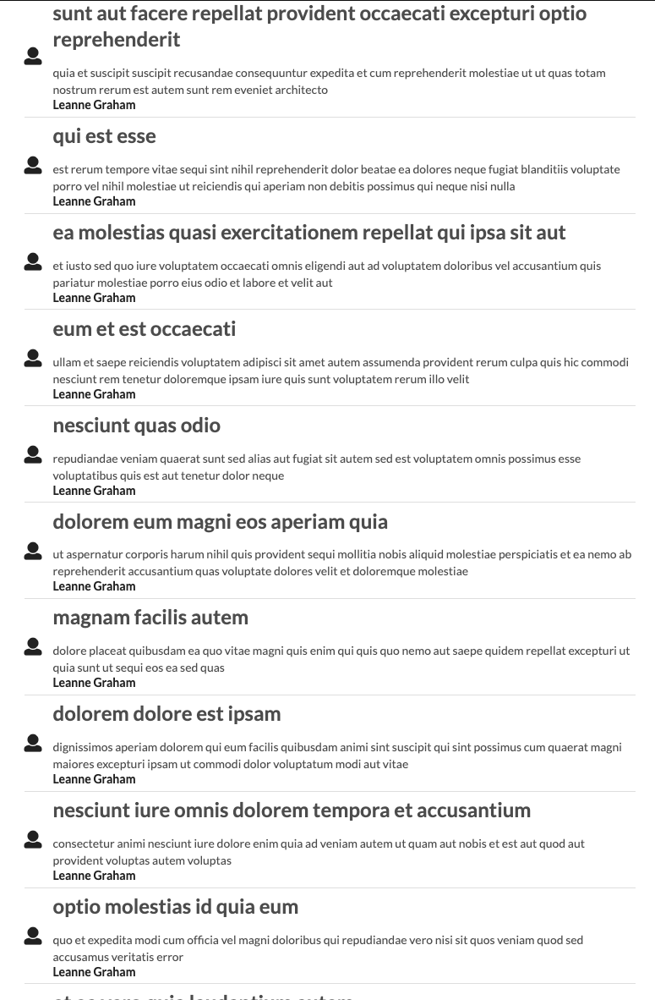

## Blog Posts

This is a single page app that uses redux-thunk to retrieve and update blogs and their companion user details. There is a single component for each blog post, and another component that handles the user's name from JSON placeholders API. The purpose of this project was to lean how to handle multiple API requests with a single action creator.

