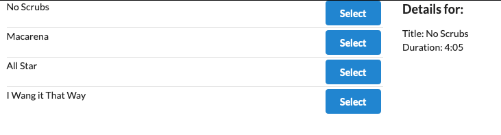

## Songs

This is an app that taught me redux flow with react-redux and maintaining a global state though all of my components rather than forcing parent components to feed data and properties to child components.

